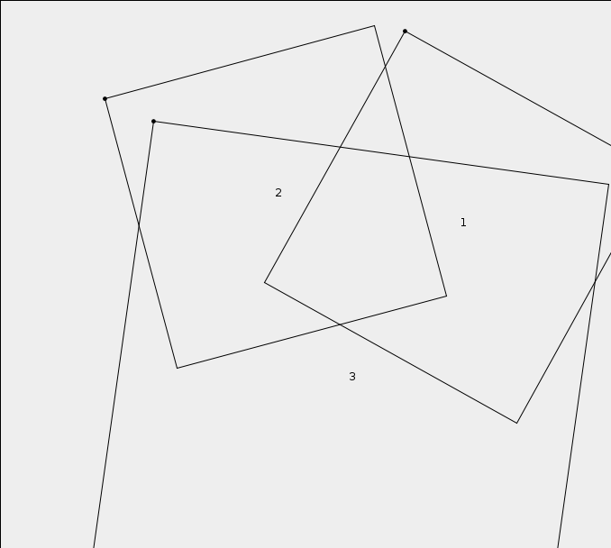
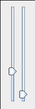
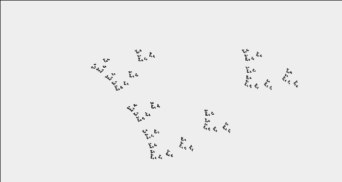

.. Copyright © 2014, 2016-2017 Martin Ueding <dev@martin-ueding.de>

##########################
iterated-fractal-generator
##########################

Generates fractals by copying the previous image into every square. Use the sliders to scale and rotate the squares and move them with the mouse.

    Setup of copy targets

    Slider for a single square

    Toolbar to create new squares and to render the fractal

    Generated fractal

`<IteratedFractalGenerator.jar>`_
